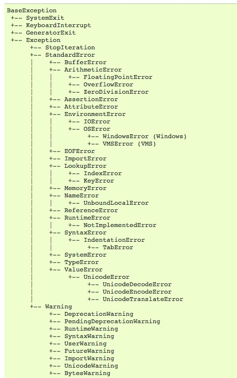

# try/except/else/finally 组合招式

这四个关键词组成了一个最完备的异常处理机制，但是很多时候我们不会一次性使用所有的关键词，而只是选择其中的一些组合。

# 第一招：try/finally 搭配

这是一个最简单的组合，我们不会在这段代码中捕捉异常，会让异常直接抛出给上层调用代码，但是使用finally可以在异常发生的时候进行相应的cleanup操作。比如打开一个文件，发现读取文件异常，那么这个时候需要用finally在异常上抛的同时做文件关闭的操作。

# 第二招: try/except/else 搭配

比如下面这段代码：

```python
import json
def load_json(data, key):
    try:
        result_dict = json.loads(data)
    except ValueError as e:  # 只捕捉ValueError
        raise KeyError from e  # 主动上抛异常
    else:
        return result_dict[key]  # KeyError 异常上抛
```

这样可以缩短try语句的长度，明确表明哪些异常不会被此方法捕捉。

# 第三招: try/except/else/finally 搭配

总体来说就是综合了1，2两招的优势。

## 想法

准确预估某段代码中的异常，并用try/except/else/finally机制进行相应的处理是保证代码健壮性的体现。

顺带附上一张Python2中的exception的构成图：


